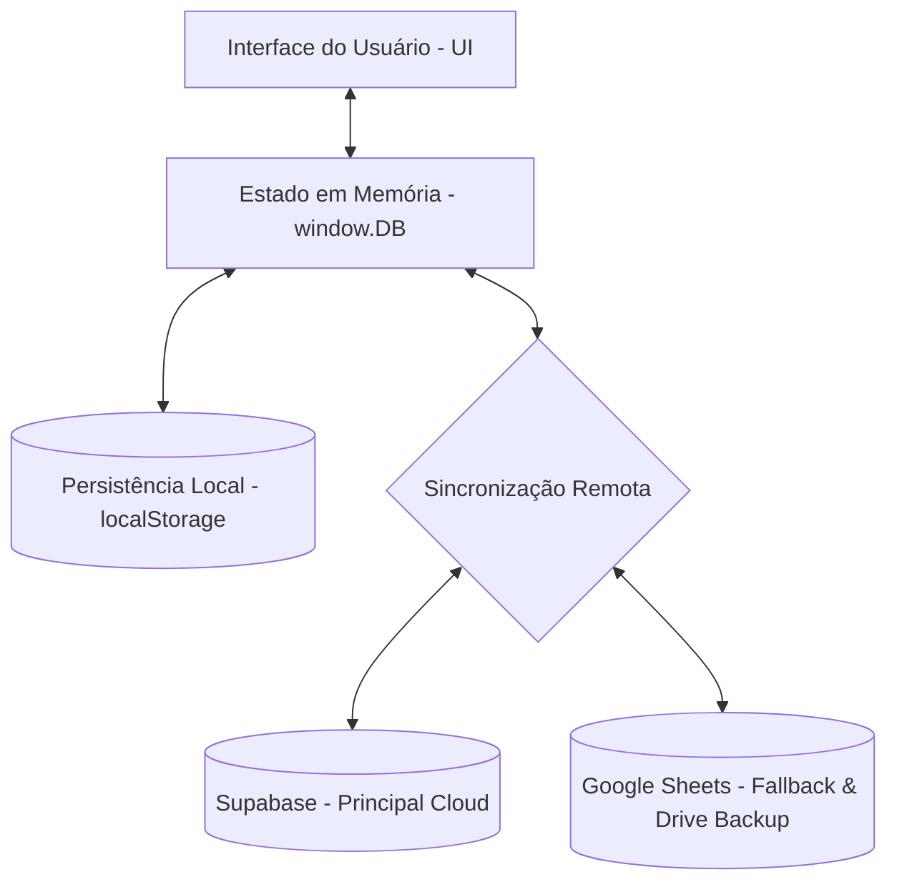

# Arquitetura e Fluxo de Dados do Sistema

Este documento detalha o funcionamento central da persistência, controle de dados e sincronização offline/online do Conveniência Oliveira.

---

## 1. Visão Geral (Core Architecture)

O sistema foi desenvolvido seguindo o padrão de **Single Page Application (SPA)** no frontend, utilizando **HTML5, CSS Vanilla** e **JavaScript nativo** para garantir performance instantânea, baixo consumo de banda e facilidade de manutenção.



### Principais Pilares:
1. **Local-First:** Todo o estado do aplicativo é mantido localmente na memória RAM (`window.DB`) e sincronizado imediatamente com o `localStorage`. Isso garante que o sistema nunca trave ou fique lento devido a latências de rede.
2. **Sincronização Bidirecional Silenciosa:** Periodicamente e durante eventos importantes (ex: finalização de venda, login), o sistema realiza a sincronização com o banco remoto.
3. **Resiliência de Rede:** Se a internet falhar, o estabelecimento continua operando normalmente. Assim que a conexão for reestabelecida, os dados acumulados localmente são mesclados com a nuvem de forma inteligente.

---

## 2. Persistência Local (`localStorage`)

Os dados são salvos na chave `convpro_db` no navegador do usuário sob a forma de uma string JSON comprimida/serializada.

### Estrutura do Objeto Local (`DB`):
```json
{
  "produtos": [
    {
      "id": 1,
      "nome": "Espetinho de Frango",
      "categoria": "Espetinho",
      "operacao": "Espetinho",
      "unidade": "un",
      "custo": 3.5,
      "preco": 8,
      "estoque": 0,
      "estoqueMin": 5,
      "status": "ativo",
      "tipo": "produzido"
    }
  ],
  "vendas": [],
  "compras": [],
  "auditoria": []
}
```

- **produtos:** Cadastro completo de itens, preços, custos, nível de estoque e quantidade mínima.
- **vendas:** Histórico completo de cupons fiscais e vendas realizadas com suas respectivas formas de pagamento, itens e datas.
- **compras:** Registro de compras e suprimentos para controle de caixa e estoque.
- **auditoria:** Logs de ações críticas executadas (ex: exclusão de venda, alteração de preço) para segurança do estabelecimento.

---

## 3. Algoritmo Smart Merge (Fusão Inteligente de Dados)

Para evitar que dados novos criados em um computador (ou celular) subscrevam e apaguem dados de outro dispositivo, foi desenvolvido o algoritmo de **Smart Merge** (`mergeRemoteDB`).

- **Regra dos IDs:** Cada produto, venda ou log possui um identificador único de chave (`id`).
- **Verificação de Existência:** Antes de inserir dados remotos, o sistema varre o array local correspondente.
- **Resolução de Conflitos:**
  - Se um ID remoto não existe localmente, ele é adicionado.
  - Se já existe, o registro local é preservado ou atualizado com base em timestamps de modificação (quando disponíveis).
  - Em produtos, o estoque e preços são reconciliados priorizando atualizações mais recentes.
