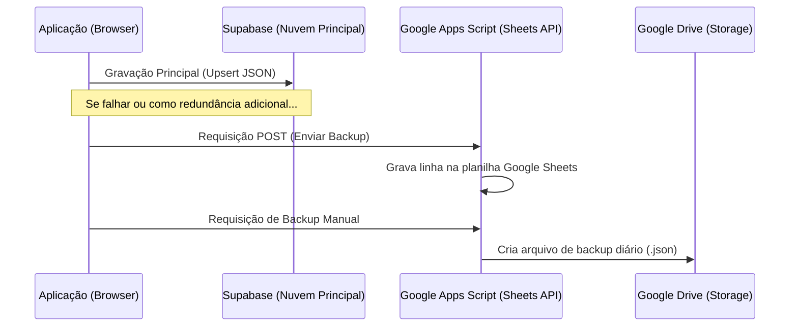

# Integração com Google Sheets & Backups (Redundância)

Este documento detalha o funcionamento da redundância de dados do sistema, as requisições ao Google Sheets (Google Apps Script) e as salvaguardas de fechamento de página.

---

## 1. Visão Geral da Redundância

O sistema adota uma estratégia de **tolerância a falhas multinível**. Se a conexão principal com o Supabase estiver indisponível ou instável, o sistema utiliza o Google Sheets como um canal secundário de backup e sincronização de dados.

---

## 2. O Backend do Google Sheets (Apps Script)

A comunicação com as planilhas do Google é feita por chamadas de rede do tipo `fetch` para uma URL pública do **Google Apps Script** (Web App), configurada na constante `GOOGLE_SHEETS_URL` no código do sistema.

### Métodos Disponíveis:
- **`carregar`**: Recupera o último estado salvo de banco de dados gravado na planilha para fins de reconciliação de histórico.
- **`salvar`**: Grava o JSON compactado em uma linha na aba correspondente, acompanhado da data/hora e do usuário que realizou a ação.

---

## 3. Salvaguarda no Fechamento (Backup `beforeunload`)

Para evitar a perda de dados no cenário onde um funcionário fecha o navegador sem clicar em salvar ou sair, o sistema implementa uma escuta ativa no evento de fechamento da aba (`beforeunload`).

- Ao fechar ou atualizar a página, o navegador intercepta a ação.
- O sistema dispara uma chamada síncrona/background para o script do Google Sheets para salvar o estado atual de `window.DB` em nuvem imediatamente antes do descarregamento da página.
- Isso assegura que mesmo em saídas acidentais ou quedas de energia no computador local, o progresso das mesas abertas e vendas do dia seja preservado.

---

## 4. Backup Manual no Google Drive

Localizado no menu de Configurações / Backups do sistema, o usuário administrador ou desenvolvedor pode realizar a geração de backups históricos diretamente em sua conta do **Google Drive**:

- **Fluxo do Botão `Backup Drive`:**
  1. A aplicação dispara o método `salvarBackupGoogleDrive()`.
  2. A chamada aciona o endpoint do Apps Script passando o parâmetro de backup.
  3. O Apps Script gera um arquivo físico do tipo `.json` contendo o payload completo e o armazena em uma pasta designada no Google Drive.
  4. O sistema retorna um feedback visual de sucesso (`showToast`) na tela após o salvamento ser concluído com sucesso.
