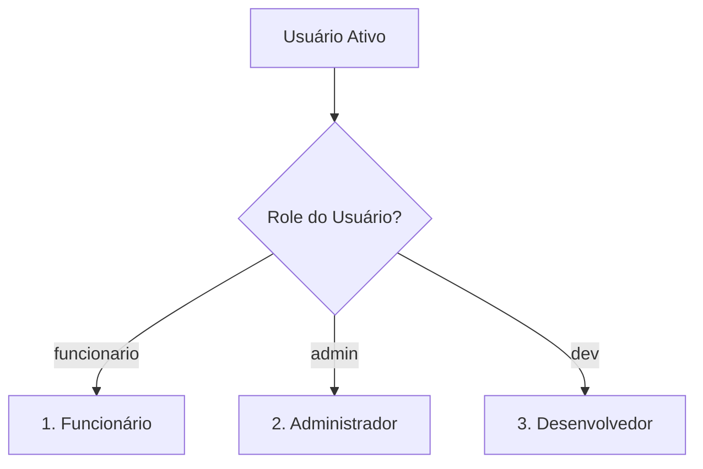

# Gestão de Usuários e Níveis de Permissão (Roles)

Este documento detalha o sistema de controle de acessos (RBAC - Role-Based Access Control) do sistema, definindo o que cada perfil de usuário tem permissão para visualizar e executar.

---

## 1. Níveis de Acesso (Roles)

O sistema possui três níveis distintos de privilégios atribuídos aos usuários ativos:



### 1. Perfil: Funcionário (`funcionario`)
- **Foco:** Operação diária do estabelecimento (atendimento de balcão e mesas).
- **Ações Permitidas:**
  - Acesso ao Caixa/PDV para registrar vendas.
  - Abertura, lançamento de itens e fechamento de Controles de Mesas/Comandas.
  - Visualização de catálogo básico de produtos.
- **Restrições:** Não acessa relatórios financeiros, configurações de backup, exclusão de registros ou auditorias do sistema.

### 2. Perfil: Administrador (`admin`)
- **Foco:** Gestão administrativa, financeira e de estoques do estabelecimento.
- **Ações Permitidas (Todas de Funcionário, mais):**
  - Acesso ao Dashboard financeiro (faturamento diário/mensal, ticket médio, gráficos de desempenho).
  - Cadastro, alteração de preço, custo e estoque de produtos.
  - Acesso ao controle de Compras e Despesas da empresa.
  - Visualização de logs de auditoria de operações.
  - Configurações do sistema e controle de backups (Google Drive).

### 3. Perfil: Desenvolvedor (`dev`)
- **Foco:** Manutenção de infraestrutura e diagnóstico técnico do sistema.
- **Ações Permitidas (Todas de Administrador, mais):**
  - **Acesso ao Painel do Desenvolvedor (DEV Panel):** visualização do log de atualizações (Changelog) e telemetria do Supabase em tempo real.
  - **Inspeção de Dados Brutos:** visualização e cópia do payload JSON de backup local em tempo real.
  - **Testes de Infraestrutura:** disparo de pings de latência e gravação forçada de dados diretamente na nuvem (Supabase).

---

## 2. Construção Dinâmica do Menu (Sidebar)

Para garantir que um usuário não acesse áreas para as quais não tem permissão, a barra de navegação lateral (Sidebar) é construída dinamicamente no método `buildSidebar()` com base no papel do usuário ativo (`currentUser.role`).

### Mapeamento de Itens por Role:

| Item do Menu | Rota (`navigate`) | Funcionário | Administrador | Desenvolvedor |
| :--- | :--- | :---: | :---: | :---: |
| **Caixa (PDV)** | `caixa` | 🟢 Sim | 🟢 Sim | 🟢 Sim |
| **Mesas** | `mesas` | 🟢 Sim | 🟢 Sim | 🟢 Sim |
| **Dashboard** | `dashboard` | 🔴 Não | 🟢 Sim | 🟢 Sim |
| **Produtos** | `produtos` | 🔴 Não | 🟢 Sim | 🟢 Sim |
| **Compras** | `compras` | 🔴 Não | 🟢 Sim | 🟢 Sim |
| **Backups** | `backup` | 🔴 Não | 🟢 Sim | 🟢 Sim |
| **Auditoria** | `auditoria` | 🔴 Não | 🟢 Sim | 🟢 Sim |

---

## 3. Segurança no Lado do Cliente (Client-Side Guards)

Além de ocultar os botões do menu lateral, todas as funções críticas do sistema possuem verificações explícitas de privilégios antes de sua execução para evitar acessos fraudulentos via console de desenvolvimento:

```javascript
// Exemplo de controle de privilégio em função administrativa
window.excluirVendaOriginal = function(idVenda) {
  if (currentUser.role !== 'admin' && currentUser.role !== 'dev') {
    showToast("Acesso Negado: Apenas administradores podem excluir vendas.", "error");
    return;
  }
  // Executa exclusão...
};
```
